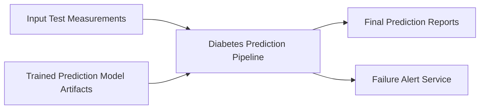

# Diabetes Prediction Pipeline

| | |
| --- | --- |
| **Type** | Pipeline |
| **Source file** | `diabetes_prediction_pipeline.json` |
| **Generated** | 2026-04-18 |

## Purpose

This pipeline uses historical patient data to create and test a predictive tool for diabetes. It helps clinical staff identify patients who might be at high risk, allowing them to intervene with preventative care.
The process reviews the latest diabetes patient records to ensure accurate predictions. First, the system checks if the prediction model needs retraining based on the current model version. If retraining is necessary, the system runs a comprehensive training step, creating and saving a new, improved model.
Before generating predictions

The business loses its ability to generate current, data-driven risk assessments for potential diabetes cases.

## Flow

The Diabetes Prediction Pipeline starts by pulling necessary patient information. It uses a current trained model and specific input data to ensure results are accurate. First, the process checks if the predictive model needs to be updated or retrained. If required, the pipeline trains a new prediction model using historical patient records. After training, the process validates the current test data records to ensure they meet quality standards.
The core function of the pipeline is generating predictions. It takes the validated test records and applies the trained model to calculate risk scores for potential diabetes cases. These calculated predictions are then automatically saved into a dedicated reporting location. If the process encounters any failure at any step, it sends an immediate alert to the internal operations team. The finished predictions are ready for managers and operations staff to view in the reporting system.

Insufficient information available.

**Steps:**
1. The pipeline starts by checking the required model version. It uses the ModelVersion parameter to determine which prediction model to use.
2. It checks if the input data set, specified by the TestTableName parameter, exists.
3. If the input data set is found, the pipeline reads the data records from the data set.
4. If the data set is empty, the pipeline stops and issues a failure alert.
5. If the model is outdated (checked using the ModelVersion parameter), the pipeline first calls the Generate-Predictions process.
    1. The Generate-Predictions process first trains a new machine learning model using a complete training data set.
    2. It then prepares a specialized test data set from the training data.
    3. Finally, it applies the newly trained model to create the prediction scores.
    4. The pipeline then accepts the updated model version and continues.
6. The pipeline applies the selected prediction model (either the newly trained one or the existing one) to the current input data records.
7. These predictions create a new data set containing the required predictions for each customer.
8. Next, the pipeline copies these generated predictions into a separate reporting data source.
9. Finally, the pipeline sends an alert notification indicating a successful run.
On failure:
  The pipeline sends an immediate alert message to the internal alert service. This notification explains the failure so staff can address the issue.

## Business Goal

Insufficient information available.

Insufficient information available.

## Data Quality & Alerts

Insufficient information available.

Insufficient information available.

## Column Lineage

No column lineage detected in this artifact.

---

*Documentation generated on 2026-04-18 from `diabetes_prediction_pipeline.json`.*