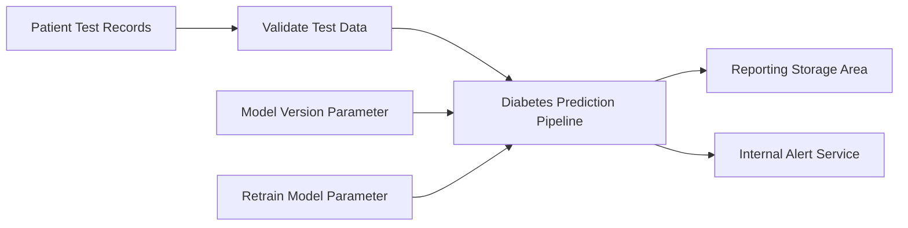

# Diabetes Prediction Pipeline

| | |
| --- | --- |
| **Type** | Pipeline |
| **Source file** | `diabetes_prediction_pipeline.json` |
| **Generated** | 2026-04-17 |

## Purpose

The Diabetes Prediction Pipeline exists so that clinical and operations staff always have an up-to-date forecast of which patients are at risk of developing diabetes. Without it, that risk information would either be absent entirely or based on outdated data, leaving care teams without the early warning they need to intervene before a patient's condition worsens.
If this process stopped running, the reporting area would no longer receive fresh predictions, and any decisions made from that data — staffing, outreach, treatment planning — would quietly become unreliable. The built-in failure alert ensures someone is notified immediately if anything goes wrong, so the gap in predictions is caught and corrected rather than going unnoticed.

## What It Does

The Diabetes Prediction Pipeline starts by checking whether the prediction model needs to be retrained. If retraining is required, it pulls anonymously available diabetes patient records from a public storage service — records that include patient age, sex, BMI, blood pressure, and several clinical measurements. It trains a new model on the majority of those records, then sets a portion aside to test how well the model performs. Once trained, the model is registered so it can be tracked and reused.
Next, the process validates the test records to confirm they are present and meet a minimum count before proceeding. If the records pass, the model scores each patient record and produces a diabetes risk prediction. Those predictions are then copied into the reporting storage area where managers and analysts can access them. If anything fails at any stage, an external notification service is called automatically to alert the responsible team.

## Flow

The Diabetes Prediction Pipeline takes patient test records from a designated data set, validates them for completeness, and then runs them through a prediction process that applies a trained model to estimate diabetes risk. Staff can control which model version to use and whether the model should be retrained before predictions are made.
Once predictions are generated, the results are copied to the reporting storage area so downstream teams can access them. If anything fails, the pipeline automatically sends an alert to the internal notifications service so the responsible team is informed without delay.

## Business Goal

The Diabetes Prediction Pipeline exists to keep the organisation's diabetes risk assessments current and accurate. It automatically decides whether the underlying prediction model needs refreshing, validates incoming patient records, and — once the data passes quality checks — produces a fresh set of risk predictions and makes them available to reporting teams. This removes the need for manual intervention in the routine cycle of updating predictions.
Clinical operations, care management, and any team that uses diabetes risk scores to prioritise patient outreach or resource allocation depend on this process. If it does not run successfully, those teams work from stale or missing risk data, which can delay care decisions. A built-in failure alert ensures the right people are notified immediately if something goes wrong, limiting the window of exposure.

## Data Quality & Alerts

The pipeline includes two built-in checkpoints before it does any significant work. First, it checks whether the prediction model actually needs to be updated — if the model is already current, the process skips retraining entirely and stops early, avoiding unnecessary work. Second, it checks that enough records arrived from the external data feed before proceeding. If the record count falls short of the expected threshold, the process triggers a follow-up action rather than continuing with incomplete data.
When something goes wrong, the pipeline does not silently continue. The record count check is designed to catch missing or incomplete data at the source, and the branch structure means the process takes a different path — likely pausing or raising an issue — rather than producing results based on bad inputs. There is no indication that individual bad records are skipped or flagged one by one; instead, the controls operate at the level of the whole data set. If the data passes both checks, the process runs with a built-in 70/30 split to keep a portion of records separate for validation, and results are logged to an experiment tracker so outcomes can be reviewed and compared over time.

---

*Documentation generated on 2026-04-17 from `diabetes_prediction_pipeline.json`.*