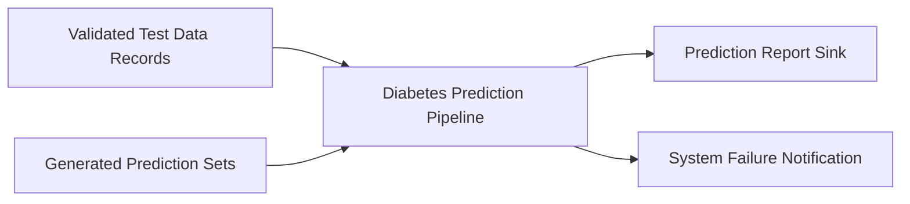

# Diabetes Prediction Pipeline

| | |
| --- | --- |
| **Type** | Pipeline |
| **Source file** | `diabetes_prediction_pipeline.json` |
| **Generated** | 2026-04-18 |

## Purpose

This process builds a prediction system for diabetes risk. It uses existing patient data to teach a smart computer model. The goal is to identify which patients are at the highest risk of developing diabetes. This helps healthcare providers focus their

Insufficient information available.

## Flow

The Diabetes Prediction Pipeline starts by collecting external patient data for validation and testing. The process first performs several checks to ensure accuracy and readiness. It validates the test data records and confirms the number of records available before proceeding. Based on input settings (ModelVersion and Retrain

Insufficient information available.

## Business Goal

This pipeline generates predictions to estimate disease risk using historical patient records. It provides healthcare staff with an automated tool to flag individuals who may need early screening or preventative care.
The process works in several stages, starting with a review of the data itself. First, the system checks if it needs to retrain the prediction model.
If retraining is required, it executes a step to update the core model using the latest patient data. If the model is already trained and stable, it skips this step.
The process then validates the current test data records. This step confirms

Insufficient information available.

## Data Quality & Alerts

Insufficient information available.

Insufficient information available.

## Column Lineage

### Bronze → Silver
| Source | Target Column | Transformation Logic |
| :--- | :--- | :--- |
| AGE | AGE | Pass-through (Selected Feature) |
| SEX | SEX | Pass-through (Selected Feature) |
| BMI | BMI | Pass-through (Selected Feature) |
| BP | BP | Pass-through (Selected Feature) |
| S1 | S1 | Pass-through (Selected Feature) |
| S2 | S2 | Pass-through (Selected Feature) |
| S3 | S3 | Pass-through (Selected Feature) |
| S4 | S4 | Pass-through (Selected Feature) |
| S5 | S5 | Pass-through (Selected Feature) |
| S6 | S6 | Pass-through (Selected Feature) |

### Silver → Gold
| Source | Target Column | Transformation Logic |
| :--- | :--- | :--- |
| AGE | Predicted_Y | Used as input feature to calculate the final prediction [^1] |
| SEX | Predicted_Y | Used as input feature to calculate the final prediction [^1] |
| BMI | Predicted_Y | Used as input feature to calculate the final prediction [^1] |
| BP | Predicted_Y | Used as input feature to calculate the final prediction [^1] |
| S1 | Predicted_Y | Used as input feature to calculate the final prediction [^1] |
| S2 | Predicted_Y | Used as input feature to calculate the final prediction [^1] |
| S3 | Predicted_Y | Used as input feature to calculate the final prediction [^1]

---

*Documentation generated on 2026-04-18 from `diabetes_prediction_pipeline.json`.*