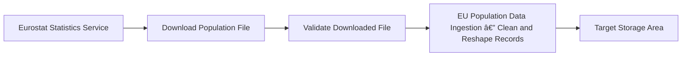

# EU Population Data Ingestion

| | |
| --- | --- |
| **Type** | Pipeline |
| **Source file** | `population_data_ingestion.json` |
| **Generated** | 2026-04-17 |

## Purpose

The EU Population Data Ingestion process exists to keep the organisation's population figures accurate and up to date. Without it, teams that rely on population data — for planning, forecasting, or performance reporting — would be working from outdated or incomplete numbers.
If this process did not run, any report or calculation that depends on EU population figures would either fail entirely or produce results based on stale data. Decisions about market sizing, regional resource allocation, or regulatory reporting could be made on figures that no longer reflect reality.

## What It Does

The EU Population Data Ingestion process pulls official projected population figures from Eurostat, the European Union's statistics authority, and prepares them for use in internal reporting. It runs automatically, without manual intervention, and covers population projections broken down by region across EU member states.
The process begins by downloading a data file directly from the Eurostat website. Once the file arrives, the process checks that it is not empty before doing anything further. If the file passes that check, a linked data process takes over: it loads the raw records, cleans and reshapes them — splitting combined fields, removing unnecessary columns, standardising text spacing, converting values into consistent formats, and filtering out records that fall outside the scope of reporting. The process then repeats this transformation step for each region covered in the file, ensuring every geographic area is handled consistently. Finally, any temporary files created during the download are removed, and the clean, transformed data records are saved into the central reporting storage area, ready for use by downstream reports and dashboards.

## Flow

This process pulls population projection files from Eurostat, the European Union's official statistics service, and validates them before any further work begins. It accepts three inputs at run time: which regions to include, which projection scenario to apply, and where the final records should land.
Once the file passes validation, a linked data process cleans and reshapes the records — splitting combined fields, removing unnecessary columns, standardising formats, and filtering to the relevant population segments. The finished data set is then saved to the target storage area specified at run time, ready for downstream reporting or analysis.

## Business Goal

The EU Population Data Ingestion process keeps the organisation's population figures current and accurate by pulling the latest projections directly from Eurostat, Europe's official statistical authority. It validates the data on arrival, applies standard business rules, and delivers a clean, ready-to-use data set to the central reporting area. Without this process running successfully, any population figures used across the business would be stale or missing entirely.
Teams that size markets, plan resource allocation, or track demographic trends across European regions depend on this data being present and up to date. Strategic planning, sales territory management, and regulatory reporting are all downstream of it — any analysis that answers "how many people live where, and how is that changing?" draws from what this process delivers.

## Data Quality & Alerts

The process includes one explicit check after the file arrives from the Eurostat data feed: it confirms the file is not empty before doing anything further. If the file arrives with no content — for example, because the external service returned an error or the download was incomplete — the process takes a separate path defined by that branch. Based on the configuration, one follow-up action is triggered in that failure case, though the exact response (stop, alert, or skip) is not fully visible in the excerpt provided.

---

*Documentation generated on 2026-04-17 from `population_data_ingestion.json`.*