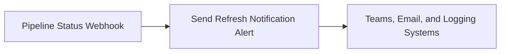

# Population Data Refresh Notification

| | |
| --- | --- |
| **Type** | Power Automate Flow |
| **Source file** | `population_data_refresh_notification.json` |
| **Generated** | 2026-04-18 |

## Purpose

This process notifies staff automatically when the EU Population Data updates finish. This ensures business stakeholders know immediately if the necessary population data is ready for analysis or if there is a problem that needs fixing.
When the main data

Insufficient information available.

## Flow

This process automatically monitors the EU Population Data refresh run. It starts when the primary data pipeline sends a status update, telling the system whether the data loaded successfully or encountered an error. Once it receives this update, the automated system immediately processes the outcome. It records every single run's status into a central log in SharePoint, ensuring a clear history of the data loading process.
Depending on the result, the system sends tailored notifications to the business users. If the data refresh succeeds, it posts a confirmation message to Microsoft Teams and sends a confirmation email to the analytics team. If the data refresh fails, the system handles multiple critical steps: it posts an alert to Teams, sends a failure email, and automatically creates an incident task in Microsoft Planner so that the correct team can begin investigating the issue right away.

Insufficient information available.

**Steps:**
1. The process automatically starts when the European Union Population Data ingestion pipeline sends an external alert.
2. The process first takes this alert and reviews the details. It checks the final status provided by the pipeline.
3. If the process determines the status is successful:
    * It posts a success message immediately to the designated Microsoft Teams channel.
    * It sends a confirmation email to the required stakeholders.
4. If the process determines the status is unsuccessful (a failure):
    * It posts a detailed failure alert message to Microsoft Teams.
    * It sends a failure notification email to the required stakeholders.
    * It creates a mandatory incident task within Microsoft Planner to ensure someone investigates the problem immediately.
5. Regardless of whether the pipeline finished successfully or failed, the process records a summary of the entire run—including the start time, end time, and final status—to the dedicated SharePoint log file.

## Business Goal

Insufficient information available.

Insufficient information available.

## Data Quality & Alerts

Insufficient information available.

Insufficient information available.

## Column Lineage

No column lineage detected in this artifact.

---

*Documentation generated on 2026-04-18 from `population_data_refresh_notification.json`.*